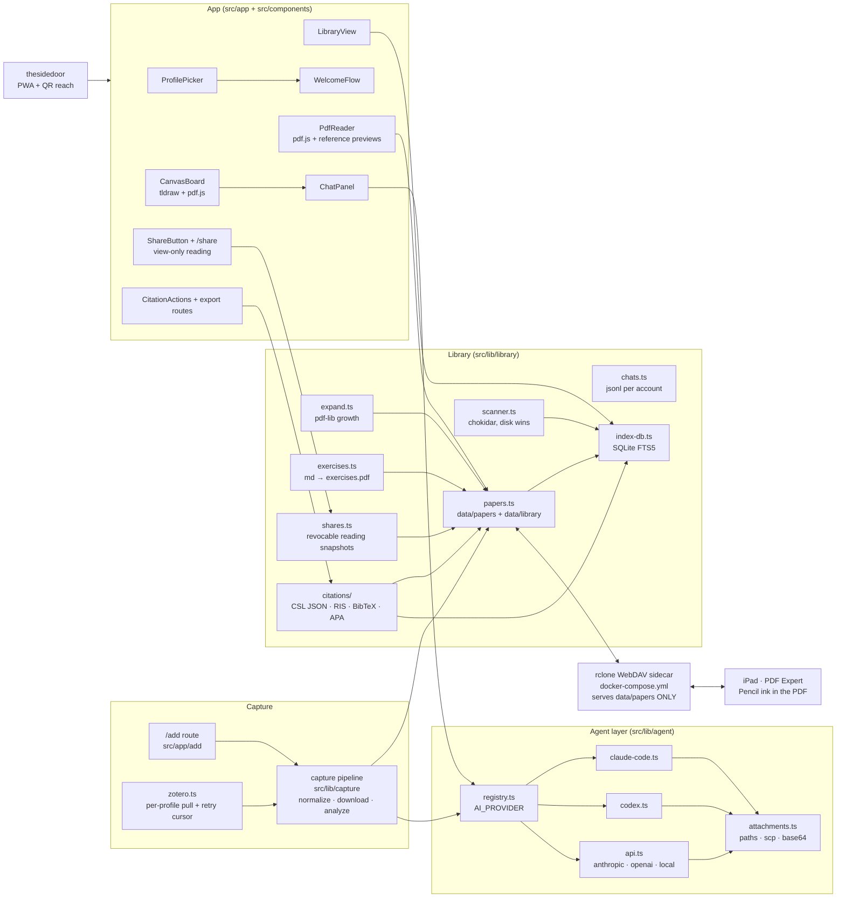

<div align="center">


# papernook

### Your papers, annotated and understood, on your own server.

Capture a paper from any browser. Annotate the original PDF with Apple Pencil.
Ask your own AI grounded questions, then share a revocable, view-only reading.

**Your papers, your ink, your conversations, on a stack you control.**

<br/>

[](#self-host)
[](#bring-your-own-agent)
[](.github/workflows/ci.yml)
[](.github/workflows/codeql.yml)
[](.github/workflows/gitleaks.yml)
[](.github/dependabot.yml)
[](https://nextjs.org)
[](https://www.typescriptlang.org/)
[](https://www.sqlite.org/fts5.html)
[](https://tldraw.dev)

<sub>The filesystem is the source of truth. Delete the index, keep your library.</sub>

</div>

---

[Quick start](#quick-start) · [Workflow](#the-reading-loop) ·
[Highlights](#why-papernook) · [Integrations](#integrations) ·
[Documentation](#documentation)

## Quick start

```bash
curl -fsSL https://raw.githubusercontent.com/affromero/papernook/main/scripts/install.sh | bash
# clones the repo, detects Codex/Claude when available, writes .env, docker compose up
```

Open **http://localhost:3000** and create a profile. The two-minute wizard
checks the configured agent—or auto-connects a ready local Codex/Claude
CLI—creates personal capture tools, and walks through iPad WebDAV setup.


## The reading loop

| Step              | What happens                                                                                                             |
| ----------------- | ------------------------------------------------------------------------------------------------------------------------ |
| **1. Capture**    | Save arXiv, PDF, and publisher pages from Safari, Chrome, or Papernook. AI proposes the topic, tags, summary, and links. |
| **2. Annotate**   | Open the same PDF over WebDAV. Pencil ink is embedded directly in the file on your server.                               |
| **3. Understand** | Chat with the paper, paste marked-up screenshots, or send a canvas selection for explanation.                            |
| **4. Practice**   | Turn an answer into a Pencil-ready exercise PDF, add margins, or append blank pages without shifting existing ink.       |
| **5. Share**      | Send a revocable annotated reading. Conversation snapshots are explicit, immutable, and off by default.                  |

## Why Papernook

| Your workflow                  | Papernook's approach                                                                              |
| ------------------------------ | ------------------------------------------------------------------------------------------------- |
| **Files stay portable**        | PDFs hold their own annotations; metadata, summaries, canvases, and chats use plain files.        |
| **Your AI stays replaceable**  | Choose Claude Code, Codex, an API provider, or a local OpenAI-compatible server.                  |
| **Reading stays connected**    | Search, citations, grounded chat, exercises, and a spatial canvas live beside the paper.          |
| **People stay separate**       | The library is shared; profiles keep chats, capture tokens, and Zotero connections private.       |
| **Sharing stays intentional**  | Links are revocable and view-only; private conversations appear only when explicitly snapshotted. |
| **The index stays disposable** | SQLite accelerates search, but the filesystem remains the source of truth and rebuilds the index. |

<details>
<summary><strong>Architecture and data flow</strong></summary>

Every node is a real module in this repository.



</details>

## How Papernook is different

Papernook focuses on the self-hosted annotated-paper-to-understanding loop.
Zotero remains substantially stronger for live citations, thousands of styles,
and mature group reference management.

<details>
<summary><strong>Compare built-in capabilities</strong></summary>

The matrix counts only officially documented, built-in behavior that matches
the capability exactly, without third-party plugins or handoffs.

| Capability                                           | **Papernook** | [Zotero](https://www.zotero.org/support/groups) | [Paperpile](https://paperpile.com/features/) | [Readwise Reader](https://docs.readwise.io/reader/docs) | [NotebookLM](https://support.google.com/notebooklm/answer/16164461) |
| ---------------------------------------------------- | :-----------: | :---------------------------------------------: | :------------------------------------------: | :-----------------------------------------------------: | :-----------------------------------------------------------------: |
| One-click capture from supported publisher/PDF pages |       ✓       |                        ✓                        |                      ✓                       |                            ✓                            |                                  ✗                                  |
| Organize with collections/folders, tags, and search  |       ✓       |                        ✓                        |                      ✓                       |                            ✓                            |                                  ✗                                  |
| Built-in PDF highlighting and annotation editor      |       ✗       |                        ✓                        |                      ✓                       |                            ✓                            |                                  ✗                                  |
| Export reference metadata as RIS or BibTeX           |       ✓       |                        ✓                        |                      ✓                       |                            ✗                            |                                  ✗                                  |
| Live citations and bibliographies in writing tools   |       ✗       |                        ✓                        |                      ✓                       |                            ✗                            |                                  ✗                                  |
| Dedicated collaborative group libraries with roles   |       ✗       |                        ✓                        |                      ✓                       |                            ✗                            |                                  ✗                                  |
| Self-host the complete app and data                  |       ✓       |                        ✗                        |                      ✗                       |                            ✗                            |                                  ✗                                  |
| Annotations are saved directly into the standard PDF |       ✓       |                        ✗                        |                      ✓                       |                            ✗                            |                                  ✗                                  |
| Edit the same PDF from iPad apps over WebDAV         |       ✓       |                        ✗                        |                      ✗                       |                            ✗                            |                                  ✗                                  |
| Grounded document chat inside the reading app        |       ✓       |                        ✗                        |                      ✗                       |                            ✓                            |                                  ✓                                  |
| Choose a local, SSH, or API AI backend               |       ✓       |                        ✗                        |                      ✗                       |                            ✗                            |                                  ✗                                  |
| Infinite canvas around each paper                    |       ✓       |                        ✗                        |                      ✗                       |                            ✗                            |                                  ✗                                  |
| Share an uploaded, annotated PDF by link             |       ✓       |                        ✗                        |                      ✓                       |                            ✗                            |                                  ✗                                  |
| Share selected owner conversations beside that PDF   |       ✓       |                        ✗                        |                      ✗                       |                            ✗                            |                                  ✗                                  |

Sources: [Zotero collections, search, and citation styles](https://www.zotero.org/support/quick_start_guide),
[word processor integration](https://www.zotero.org/support/word_processor_integration),
[standardized formats](https://www.zotero.org/support/kb/importing_standardized_formats),
and [annotation storage](https://www.zotero.org/support/kb/annotations_in_database);
[Paperpile exports](https://paperpile.com/h/export-library-data/),
[embedded annotations](https://paperpile.com/h/view-annotate-with-other-pdf-viewers/),
and [annotation sharing](https://paperpile.com/h/sharing-notes-annotations/);
[Readwise chat](https://docs.readwise.io/reader/guides/ghostreader/chat),
[exports](https://docs.readwise.io/reader/docs/faqs/exporting), and
[sharing limits](https://docs.readwise.io/reader/docs/faqs/sharing).

</details>

## Bring your own agent

`AI_PROVIDER` is selected at install time, never hardcoded. Use a local CLI,
run that CLI over SSH, provide an API key, or connect a local model server.

<details>
<summary><strong>Providers and configuration</strong></summary>

| Mode                   | Config                                                      | Keyless |
| ---------------------- | ----------------------------------------------------------- | ------- |
| Claude Code CLI, local | `AI_PROVIDER=claude-code`                                   | ✓       |
| Codex CLI, local       | `AI_PROVIDER=codex`                                         | ✓       |
| Claude Code over SSH   | `AI_PROVIDER=claude-code` + `CLAUDE_CODE_SSH_HOST=you@host` | ✓       |
| Codex over SSH         | `AI_PROVIDER=codex` + `CODEX_SSH_HOST=you@host`             | ✓       |
| Anthropic API          | `AI_PROVIDER=anthropic` + `ANTHROPIC_API_KEY`               | ✗       |
| OpenAI API             | `AI_PROVIDER=openai` + `OPENAI_API_KEY`                     | ✗       |
| Ollama                 | `AI_PROVIDER=ollama` + `OLLAMA_MODEL=qwen3:4b`              | ✓       |
| llama.cpp server       | `AI_PROVIDER=llamacpp` + `LLAMACPP_MODEL=<model-id>`        | ✓       |
| vLLM server            | `AI_PROVIDER=vllm` + `VLLM_MODEL=<model-id>`                | ✓       |

Settings detects local endpoints and installed models. Docker reaches local
servers through `host.docker.internal`; Papernook does not publish model ports.
Images use the native attachment mechanism for each transport. Local image chat
requires a vision-capable model, and paper capture needs enough context for
roughly 60,000 characters. Provider errors surface without silent fallback.

The installer prefers an authenticated local Codex CLI, then Claude Code. In
Docker, Compose mounts the host CLI configuration read-only and the entrypoint
copies it into a writable container home. An installed but logged-out CLI is
shown as needing login, not ready. macOS keeps Claude credentials in Keychain,
which containers cannot read; run `claude setup-token` and set
`CLAUDE_CODE_OAUTH_TOKEN` in `.env` when using Claude Code through Docker.

</details>

## Integrations

### Zotero

Each profile can connect a personal Zotero library. New PDF items pull every
30 minutes or on demand, pass through the normal AI filing flow, and appear in
a one-glance review strip. Papernook preserves tags, collections, authors,
publication fields, identifiers, abstract, URL, and language.

Create a read-only key at [zotero.org/settings/keys](https://www.zotero.org/settings/keys),
then open **Settings → Zotero sync**. Imports join the shared paper library;
connections and chats remain per-profile. Deduplication uses Zotero item keys
and arXiv IDs, and failed items retry without replaying successful imports.

Every paper’s **Cite** menu copies APA or downloads CSL JSON, RIS, or BibTeX.
Library exports respect the active search, topic, and tag filters.

<details>
<summary><strong>Other reference managers</strong></summary>

| Tool              | Sync            | How                                                                     |
| ----------------- | --------------- | ----------------------------------------------------------------------- |
| Zotero            | ✓ built in      | Per-profile API key; new PDF items pull in every 30 min or on demand    |
| Mendeley          | possible        | Public REST API still up, but OAuth app registration adds friction      |
| Readwise Reader   | possible        | Clean token-authed V3 API exposes saved documents                       |
| Paperpile         | workaround only | No public API; its Google Drive folder sync could feed a watched folder |
| EndNote, ReadCube | ✗               | No usable public API                                                    |

</details>

## Self-host

Docker Compose runs the Next.js app and an rclone WebDAV sidecar. WebDAV serves
**`data/papers` only**; chats, crops, and canvases stay private. Connect through
[Tailscale](https://tailscale.com) or a hardened custom domain. Settings
generates the correct device QR code for the address in use.

For a custom domain, the admin owns one `PAPERNOOK_PASSWORD`. Friends pass that
single gate or use a signed invite, then create a profile without setting a
password. For Tailscale-only access, machine/tailnet membership is the outer
boundary. See [Invite a friend](docs/user-guide.md#invite-a-friend).

## Documentation

Start with the **[visual documentation home](docs/README.md)**.

| I want to…                            | Guide                                                 |
| ------------------------------------- | ----------------------------------------------------- |
| Learn the everyday workflow           | [User guide](docs/user-guide.md)                      |
| Invite someone by domain or Tailscale | [Invite a friend](docs/user-guide.md#invite-a-friend) |
| Capture from Safari or iOS            | [Shortcut setup](docs/shortcut.md)                    |
| Annotate from an iPad                 | [WebDAV walkthrough](docs/ipad-annotation.md)         |
| Expose a custom domain safely         | [Public hardening](docs/public-exposure.md)           |

## Development

```bash
npm install          # postinstall copies the sidedoor service worker
npm run dev
npm run ci           # lint + typecheck + vitest + build (pre-push runs this too)
npm run test:e2e     # Playwright journeys against committed docs screenshots
npm run screenshots # intentionally refresh docs/images
pre-commit install --install-hooks   # two-tier local gate
```

<div align="center">
<sub>Avatars shared with <a href="https://github.com/affromero/Sotto">Sotto</a> · canvas by <a href="https://tldraw.dev">tldraw</a> (watermark license) · reach by <a href="https://github.com/affromero/sidedoor">sidedoor</a></sub>
</div>
