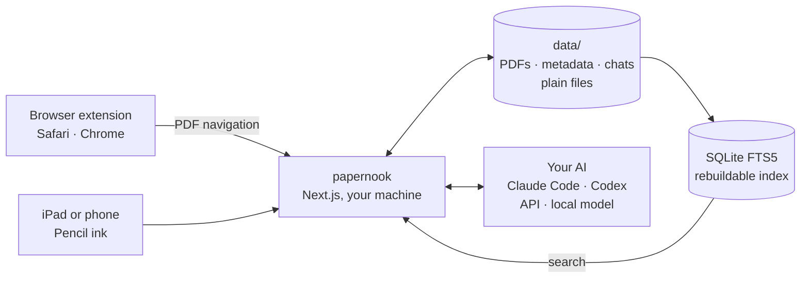
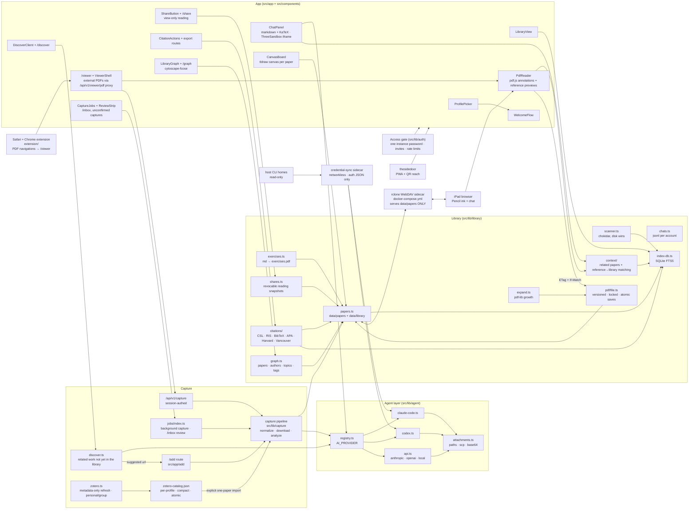

<div align="center">


# papernook

### Your papers, annotated and understood, on your own server.

Capture a paper from any browser. Annotate the original PDF with Apple Pencil.
Ask your own AI grounded questions, then share a revocable, view-only reading.

**Your papers, your ink, your conversations, on a stack you control.**

<br/>

[](#self-host)
[](#bring-your-own-agent)
[](https://github.com/affromero/papernook/releases/latest)
[](https://apps.apple.com/app/id6799779482)
[](LICENSE)
[](.github/workflows/ci.yml)
[](.github/workflows/codeql.yml)
[](.github/workflows/gitleaks.yml)
[](.github/dependabot.yml)
[](extension/README.md#chrome)
[](extension/README.md#safari)
[](extension/manifest.json)
[](https://nextjs.org)
[](https://www.typescriptlang.org/)
[](https://www.sqlite.org/fts5.html)

<sub>The filesystem is the source of truth. Delete the index, keep your library.</sub>

</div>

---

[How it works](#how-it-works) · [Quick start](#quick-start) ·
[Workflow](#the-reading-loop) ·
[Highlights](#why-papernook) · [Integrations](#integrations) ·
[Documentation](#documentation)

## How it works

One server on a machine you control, one folder of files, and whichever AI you
already pay for.



1. **Capture.** Open a PDF on arXiv or a publisher page. The extension sends
   the navigation to your server, which downloads the paper, asks your AI for a
   topic, tags, and a summary, and files it.
2. **Annotate.** Highlight and draw in the browser. The ink is written into the
   PDF itself, so any reader on any device opens it later, with or without
   Papernook.
3. **Ask.** The chat sits beside the paper and answers from the paper. Its
   conversations are JSONL files next to the PDF, not rows in someone's
   database.

Nothing leaves your machine except the requests you configure to an AI
provider. Delete the SQLite index and the library rebuilds from the files.

## Quick start

```bash
curl -fsSL https://raw.githubusercontent.com/affromero/papernook/main/scripts/install.sh | bash
# clones the repo, detects Codex/Claude when available, writes .env, docker compose up
```

Open **http://localhost:3000** and create a profile. The two-minute wizard
checks the configured agent—or, when none is configured, selects a ready local
Codex/Claude CLI—creates personal capture tools, and shows optional WebDAV
compatibility when configured. The admin can also add the tldraw production key
used by visual paper canvases. An explicit provider that is unavailable is
reported, never replaced.

For a reproducible production install, use a release tag:

```bash
git clone --branch v0.2.0 --depth 1 https://github.com/affromero/papernook.git
cd papernook
./scripts/install.sh
```


## The reading loop


| Step              | What happens                                                                                                             |
| ----------------- | ------------------------------------------------------------------------------------------------------------------------ |
| **1. Capture**    | Save arXiv, PDF, and publisher pages from Safari, Chrome, or Papernook. AI proposes the topic, tags, summary, and links. |
| **2. Annotate**   | Highlight, add text, or draw in the web reader. Apple Pencil selects drawing automatically, and changes save to the PDF. |
| **3. Understand** | Chat with the paper beside the reader or switch between Reading and Chat on a tablet.                                    |
| **4. Practice**   | Turn an answer into a Pencil-ready exercise PDF, add margins, or append blank pages without shifting existing ink.       |
| **5. Share**      | Send a revocable annotated reading. Conversation snapshots are explicit, immutable, and off by default.                  |
| **6. Explore**    | Discover proposes related work grounded in what you already hold, and the graph links papers, authors, topics, and tags. |

Capture, end to end — the browser extension redirects an arXiv PDF into the
reader, citations preview on hover, and two clicks file the paper into the
library:


### Where to get the extension

| Browser                                                                                 | Install                                                             | Status                   |
| --------------------------------------------------------------------------------------- | ------------------------------------------------------------------- | ------------------------ |
|        | [Mac App Store](https://apps.apple.com/app/id6799779482)            | live                     |
|  | [`npm run build:chrome`](extension/README.md#chrome), load unpacked | Web Store review pending |

Both browsers run the same `extension/` source. Until the Chrome listing
clears review, build the zip yourself or grab it from the
[latest release](https://github.com/affromero/papernook/releases/latest).

## Why Papernook

A paper you actually work through ends up in three places at once: the tablet
holding the ink, the reader holding the highlights, and a chat tab holding
everything you asked about it. The annotations live in someone else's database,
the chat history belongs to whichever model you used that month, and none of it
survives leaving the product.

Papernook keeps those three in one place you own. Ink goes into the PDF itself,
so any reader on any device still opens it. Metadata, summaries, and
conversations are plain files on your disk. The AI is a setting, not a
dependency.

| Your workflow                  | Papernook's approach                                                                              |
| ------------------------------ | ------------------------------------------------------------------------------------------------- |
| **Files stay portable**        | PDFs hold their own annotations; metadata, summaries, and chats use plain files.                  |
| **Your AI stays replaceable**  | Choose Claude Code, Codex, an API provider, or a local OpenAI-compatible server.                  |
| **Reading stays connected**    | Search, citation previews, grounded chat, and exercises live beside the paper.                    |
| **Readers stay organized**     | The library is shared; profiles separate chats, capture tokens, and Zotero connections by reader. |
| **Sharing stays intentional**  | Links are revocable and view-only; conversations appear only when explicitly snapshotted.         |
| **The index stays disposable** | SQLite accelerates search, but the filesystem remains the source of truth and rebuilds the index. |

<details>
<summary><strong>Full module map and data flow</strong></summary>

Every node is a real module in this repository.

The PDF is the portable annotation layer. The web reader writes highlights,
text, and ink back with version checks so another device cannot be overwritten
silently.

| Reading surface        | Source of truth                  | Sync boundary                                                                                                                                |
| ---------------------- | -------------------------------- | -------------------------------------------------------------------------------------------------------------------------------------------- |
| Native PDF annotations | `data/papers/<topic>/<slug>.pdf` | Autosave from the web reader and flow to shared readings and optional WebDAV.                                                                |
| Reference preview      | Current PDF                      | Opens the cited entry beside the citation via embedded links or, when the PDF has none, text-recognized citations (numeric and author-year). |
| Conversations          | Per-profile JSONL                | Stay out of shares unless selected, but anyone with instance access can switch profiles and read them.                                       |



</details>

## How Papernook is different

Papernook focuses on the self-hosted annotated-paper-to-understanding loop.
Zotero remains substantially stronger for live citations, thousands of styles,
and mature group reference management.

<details>
<summary><strong>Compare built-in capabilities</strong></summary>

The matrix counts only officially documented, built-in behavior that matches
the capability exactly, without third-party plugins or handoffs.

| Capability                                           | **Papernook** | [Zotero](https://www.zotero.org/support/groups) | [Paperpile](https://paperpile.com/features/) | [Readwise Reader](https://docs.readwise.io/reader/docs) | [NotebookLM](https://support.google.com/notebooklm/answer/16164461) |
| ---------------------------------------------------- | :-----------: | :---------------------------------------------: | :------------------------------------------: | :-----------------------------------------------------: | :-----------------------------------------------------------------: |
| One-click capture from supported publisher/PDF pages |       ✓       |                        ✓                        |                      ✓                       |                            ✓                            |                                  ✗                                  |
| Organize with collections/folders, tags, and search  |       ✓       |                        ✓                        |                      ✓                       |                            ✓                            |                                  ✗                                  |
| Built-in web PDF highlighting and annotation editor  |       ✓       |                        ✓                        |                      ✓                       |                            ✓                            |                                  ✗                                  |
| Export reference metadata as RIS or BibTeX           |       ✓       |                        ✓                        |                      ✓                       |                            ✗                            |                                  ✗                                  |
| Live citations and bibliographies in writing tools   |       ✗       |                        ✓                        |                      ✓                       |                            ✗                            |                                  ✗                                  |
| Dedicated collaborative group libraries with roles   |       ✗       |                        ✓                        |                      ✓                       |                            ✗                            |                                  ✗                                  |
| Import one selected Zotero PDF into an AI workspace  |       ✓       |                        ✗                        |                      ✗                       |                            ✗                            |                                  ✗                                  |
| Use Zotero annotations as per-profile AI context     |       ✓       |                        ✗                        |                      ✗                       |                            ✗                            |                                  ✗                                  |
| Self-host the complete app and data                  |       ✓       |                        ✗                        |                      ✗                       |                            ✗                            |                                  ✗                                  |
| Annotations are saved directly into the standard PDF |       ✓       |                        ✗                        |                      ✓                       |                            ✗                            |                                  ✗                                  |
| Edit the same PDF from iPad apps over WebDAV         |       ✓       |                        ✗                        |                      ✗                       |                            ✗                            |                                  ✗                                  |
| Preview linked references without losing your place  |       ✓       |                        ✗                        |                      ✗                       |                            ✗                            |                                  ✗                                  |
| Grounded document chat inside the reading app        |       ✓       |                        ✗                        |                      ✗                       |                            ✓                            |                                  ✓                                  |
| Choose a local, SSH, or API AI backend               |       ✓       |                        ✗                        |                      ✗                       |                            ✗                            |                                  ✗                                  |
| Generate printable exercise PDFs from a paper        |       ✓       |                        ✗                        |                      ✗                       |                            ✗                            |                                  ✗                                  |
| Grow PDF margins or add pages without shifting ink   |       ✓       |                        ✗                        |                      ✗                       |                            ✗                            |                                  ✗                                  |
| Whole-library visual relationship graph              |       ✓       |                        ✗                        |                      ✗                       |                            ✗                            |                                  ✗                                  |
| Share an uploaded, annotated PDF by link             |       ✓       |                        ✗                        |                      ✓                       |                            ✗                            |                                  ✗                                  |
| Share selected owner conversations beside that PDF   |       ✓       |                        ✗                        |                      ✗                       |                            ✗                            |                                  ✗                                  |

Sources: [Zotero collections, search, and citation styles](https://www.zotero.org/support/quick_start_guide),
[PDF reader and annotation editor](https://www.zotero.org/support/pdf_reader),
[word processor integration](https://www.zotero.org/support/word_processor_integration),
[standardized formats](https://www.zotero.org/support/kb/importing_standardized_formats),
and [annotation storage](https://www.zotero.org/support/kb/annotations_in_database);
[Paperpile exports](https://paperpile.com/h/export-library-data/),
[embedded annotations](https://paperpile.com/h/view-annotate-with-other-pdf-viewers/),
and [annotation sharing](https://paperpile.com/h/sharing-notes-annotations/);
[Readwise chat](https://docs.readwise.io/reader/guides/ghostreader/chat),
[exports](https://docs.readwise.io/reader/docs/faqs/exporting), and
[sharing limits](https://docs.readwise.io/reader/docs/faqs/sharing);
and [NotebookLM study outputs](https://support.google.com/notebooklm/answer/16164461)
and [quizzes](https://support.google.com/notebooklm/answer/16958963).

</details>

## Bring your own agent

`AI_PROVIDER` is selected at install time, never hardcoded. Use a local CLI,
run that CLI over SSH, provide an API key, or connect a local model server.

<details>
<summary><strong>Providers and configuration</strong></summary>

| Mode                   | Config                                                      | Keyless |
| ---------------------- | ----------------------------------------------------------- | ------- |
| Claude Code CLI, local | `AI_PROVIDER=claude-code`                                   | ✓       |
| Codex CLI, local       | `AI_PROVIDER=codex`                                         | ✓       |
| Claude Code over SSH   | `AI_PROVIDER=claude-code` + `CLAUDE_CODE_SSH_HOST=you@host` | ✓       |
| Codex over SSH         | `AI_PROVIDER=codex` + `CODEX_SSH_HOST=you@host`             | ✓       |
| Anthropic API          | `AI_PROVIDER=anthropic` + `ANTHROPIC_API_KEY`               | ✗       |
| OpenAI API             | `AI_PROVIDER=openai` + `OPENAI_API_KEY`                     | ✗       |
| Ollama                 | `AI_PROVIDER=ollama` + model in Settings                    | ✓       |
| llama.cpp server       | `AI_PROVIDER=llamacpp` + model in Settings                  | ✓       |
| vLLM server            | `AI_PROVIDER=vllm` + model in Settings                      | ✓       |

Settings detects local endpoints and installed models. Docker reaches local
servers through `host.docker.internal`; Papernook does not publish model ports.
Images use the native attachment mechanism for each transport. Local image chat
requires a vision-capable model, and paper capture needs enough context for
roughly 60,000 characters. Provider errors surface without silent fallback.

Web access is on by default and can be disabled by an admin in Settings.
Claude Code, Codex, Anthropic, and the OpenAI Responses API use their native
search tools. Ollama, llama.cpp, vLLM, and custom OpenAI-compatible endpoints
use Papernook's bounded `web_search` / SSRF-guarded `web_fetch` tool loop.
Docker Compose includes a SearXNG service for those searches, exposed only on
host loopback by default (`127.0.0.1:8888`). Set `WEB_SEARCH_BASE_URL` to use a
different SearXNG instance.
Local models must support OpenAI-compatible function calling; llama.cpp and
vLLM also need their tool-call parser/template enabled for the selected model.

The installer prefers an authenticated local Codex CLI, then Claude Code. In
Docker, Compose gives a networkless sidecar read-only access to the selected
CLI credential directory and copies only its auth JSON into a private volume.
Use **Reload CLI login** in Settings after signing in or out; active chats are
not interrupted. CLI history, sessions, and project configuration stay
unmounted. An installed but logged-out CLI is shown as needing login, not
ready. macOS keeps Claude credentials in Keychain, which containers cannot
read; run `claude setup-token` and set `CLAUDE_CODE_OAUTH_TOKEN` in `.env` when
using Claude Code through Docker.

Configure both `CODEX_AUTH_DIR` and `CLAUDE_AUTH_DIR` only when both local CLIs
should be selectable.

</details>

## Integrations

### Canvas

Each paper has a shared visual canvas for screenshots, links, videos, diagrams,
and freehand notes. The canvas uses the tldraw SDK, which requires a hobby,
trial, or commercial license key on production domains. The admin can get and
save a key from the setup wizard or **Settings → Canvas**; no rebuild or restart
is required. `TLDRAW_LICENSE_KEY` remains available for environment-managed
deployments, and a key saved in Settings takes precedence.

License keys are public and validated by tldraw in the browser. If a key is
missing, invalid, expired, or issued for another domain, Papernook shows an
actionable setup panel instead of an empty canvas.

### Zotero

Each profile independently connects one personal or accessible group Zotero
library. Papernook refreshes a compact, per-profile catalog of metadata and
annotations every 30 minutes or on demand. It can catalog the whole library or
selected collections; subcollections are included automatically.

**Connecting never downloads PDFs and never calls an AI provider.** Browse or
search the catalog in Settings, then explicitly import one paper when you want
it in Papernook. That action downloads only that paper (100 MB maximum), runs
the configured AI filing flow once, and adds it to the shared library. Existing
Zotero annotations for that paper become per-profile context for the connected
profile's conversations. They are treated as untrusted quoted source material
and are never added directly to shared links.

Create a dedicated key at
[zotero.org/settings/keys](https://www.zotero.org/settings/keys), enable library
read access, then open **Settings → Zotero sync**. File access is required only
to import stored PDFs; write access is never required. Imports join the shared
Papernook paper library, while connections, catalog associations, annotation
context, and chats remain per-profile. Deduplication scopes Zotero item keys to
their source library and also checks DOI and arXiv identity.

The catalog is a disposable cache under
`data/users/<username>/zotero-catalog.json`; Zotero remains its source of truth.
The size of Zotero file storage—even libraries larger than 1 GB—does not cause
Papernook to copy those files: refresh transfers metadata only. The local
catalog is capped at 200,000 records and 64 MB; if metadata exceeds either
limit, refresh fails visibly without advancing the sync cursor or replacing the
last valid catalog.
Incremental refreshes process metadata updates and deletions without deleting
already imported Papernook papers. Later Zotero edits refresh only
Zotero-owned metadata, leaving the PDF, Pencil ink, topic, summary, chats,
canvas, and exercises untouched. See Zotero's
[versioned sync API](https://www.zotero.org/support/dev/web_api/v3/syncing),
[annotation storage model](https://www.zotero.org/support/kb/annotations_in_database),
and [full-text API](https://www.zotero.org/support/dev/web_api/v3/fulltext_content).

Every paper’s **Cite** menu copies APA, Harvard, or Vancouver bibliography
entries, or downloads CSL JSON, RIS, or BibTeX. Library exports respect the
active search, topic, and tag filters.

<details>
<summary><strong>Other reference managers</strong></summary>

| Tool              | Sync            | How                                                                     |
| ----------------- | --------------- | ----------------------------------------------------------------------- |
| Zotero            | ✓ built in      | Metadata-first catalog; explicitly import individual PDFs for AI        |
| Mendeley          | possible        | Public REST API still up, but OAuth app registration adds friction      |
| Readwise Reader   | possible        | Clean token-authed V3 API exposes saved documents                       |
| Paperpile         | workaround only | No public API; its Google Drive folder sync could feed a watched folder |
| EndNote, ReadCube | ✗               | No usable public API                                                    |

</details>

## Self-host

Docker Compose runs the Next.js app, a networkless CLI credential-sync
sidecar, and an rclone WebDAV sidecar. The web reader is the primary annotation
surface on desktop and iPad. WebDAV remains an optional compatibility route
for external PDF apps when fully configured.

The WebDAV sidecar serves **`data/papers` only**; chats, crops, canvases, and
unconfirmed captures stay private. Connect through
[Tailscale](https://tailscale.com) or a hardened custom domain. Settings
generates the correct device QR code for the address in use.

Papernook always requires the single `PAPERNOOK_PASSWORD` instance credential,
regardless of hostname. Docker Compose refuses to start without it, and the
login API returns `503` if it is unset. After passing the gate, anyone may
choose any profile. Profiles organize chats and capture tokens for people who
already share the instance password. They are not a security boundary. Anyone
with the password can switch profiles and read any profile's chats.

Signed invite links open the gate for seven days without revealing the
password. Share links remain readable without a login because the unguessable
share id is the capability for one paper. For custom domains, Caddy terminates
TLS in front of app and WebDAV ports that bind to `127.0.0.1` by default. See
[Invite a friend](docs/user-guide.md#invite-a-friend) and
[custom-domain setup](docs/public-exposure.md).

## Documentation

Start with the **[visual documentation home](docs/README.md)**.

| I want to…                            | Guide                                                 |
| ------------------------------------- | ----------------------------------------------------- |
| Learn the everyday workflow           | [User guide](docs/user-guide.md)                      |
| Invite someone by domain or Tailscale | [Invite a friend](docs/user-guide.md#invite-a-friend) |
| Capture from Chrome or Safari desktop | [Browser extension](extension/README.md)              |
| Capture from an iPhone or iPad        | [Add to papernook Shortcut](docs/shortcut.md)         |
| Annotate from an iPad                 | [iPad annotation guide](docs/ipad-annotation.md)      |
| Serve the app on a custom domain      | [Custom domain setup](docs/public-exposure.md)        |
| Back up, restore, or watch the server | [Operations](docs/operations.md)                      |
| Understand the security model         | [Security policy](SECURITY.md)                        |

## Development

```bash
npm install          # postinstall patches tldraw, copies the sidedoor service worker, vendors three
npm run dev
npm run build:chrome # Web Store-ready zip in build/
npm run test:chrome  # packaged extension in real Chromium
npm run ci           # lint + typecheck + vitest + build (pre-push runs this too)
npm run test:e2e     # Playwright journeys against committed docs screenshots
npm run screenshots # intentionally refresh docs/images
pre-commit install --install-hooks   # two-tier local gate
```

## License

Papernook is available under the [MIT License](LICENSE). Third-party
dependencies and assets remain subject to their respective licenses.

<div align="center">
<sub>Avatars shared with <a href="https://github.com/affromero/Sotto">Sotto</a> · reach by <a href="https://github.com/affromero/sidedoor">sidedoor</a></sub>
</div>
