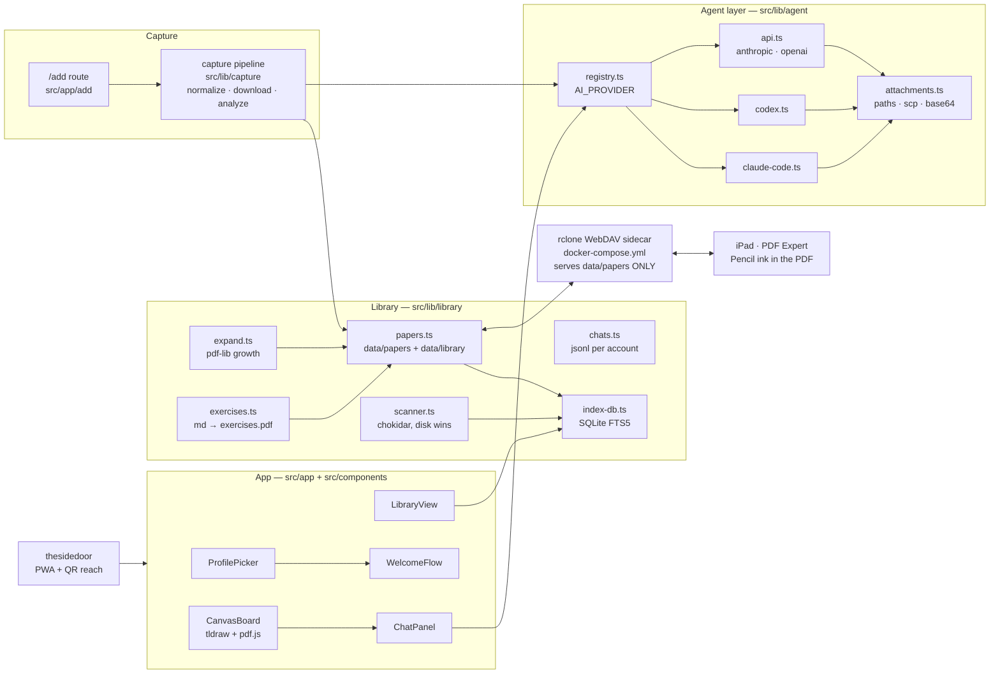

<div align="center">

# 📚 papernook

### Your papers, annotated and understood — self-hosted.

One tap from any browser files a paper into your library. The iPad opens it with the Pencil — ink lands in the PDF itself, no exports, ever. Your own AI (Claude Code, Codex, or an API key) answers questions about every paper, grounded in its text.<br/>Your papers, your ink, your conversations, on a stack **you** control.

<br/>

[](#self-host)
[](#bring-your-own-agent)
[](.github/workflows/ci.yml)
[](.github/workflows/codeql.yml)
[](.github/workflows/gitleaks.yml)
[](.github/dependabot.yml)
[](https://nextjs.org)
[](https://www.typescriptlang.org/)
[](https://www.sqlite.org/fts5.html)
[](https://tldraw.dev)

<sub>The filesystem is the source of truth. Delete the index, keep your library.</sub>

</div>

---

## Quick Start

```bash
git clone <this repo> papernook && cd papernook
./scripts/install.sh   # picks your AI (CLI / SSH / API key), writes .env, docker compose up
```

Open **http://localhost:3000**, create your profile, and the two-minute wizard takes it from there: agent test → personal bookmarklet + Shortcut → iPad WebDAV walkthrough.

## The loop

1. **Capture** — on any arxiv/paper page: click the bookmarklet (Chrome) or Share → _Add to papernook_ (Safari/iPhone/iPad). Your AI reads the PDF, proposes a topic folder, tags, a summary, related papers already in your library, and seeds starter questions. One tap to accept.
2. **Annotate** — PDF Expert on the iPad opens the same file over WebDAV. Pencil ink saves into the PDF on your server. No proprietary formats, no export step.
3. **Understand** — every paper has resumable chats grounded in its text. Paste a marked-up screenshot and ask _"explain this"_. Open the infinite canvas: the pages live on a tldraw board with your notes, video embeds, and drawings around them; select anything → _Explain selection_ sends it to the chat.
4. **Practice** — save any answer as an exercise: it renders into `<slug>.exercises.pdf`, Pencil-annotatable on the iPad. Need more writing room? Grow the PDF's margins or append blank pages without moving a single stroke of existing ink.

## Architecture

Every node below is a real module in this repo.



## What you get

- **One-tap capture** from Safari (share-sheet Shortcut) and Chrome (bookmarklet), authenticated by per-profile capture tokens — every paper is filed as the person who added it.
- **AI filing on arrival**: metadata, bibtex, topic proposal (existing folders preferred), tags, summary, cross-links to related papers in your library, and a seeded starter-questions chat.
- **Lossless iPad annotation**: standard PDF annotations over WebDAV — the file on the server _is_ the annotated source of truth.
- **Grounded chats** per paper, per profile: resumable, streaming, image-capable (paste iOS-markup screenshots or canvas selections).
- **Infinite canvas** per paper: pdf.js pages as tldraw shapes; notes, embeds, and Pencil drawing around them; `canvas.json` on disk.
- **PDF growth**: widen margins (origin-fixed — existing ink never shifts) or append blank pages, atomically, with an iPad-mid-save guard.
- **Exercises** that render to a Pencil-ready PDF next to the paper.
- **Multiple profiles, shared library**: Netflix-style picker with the eight tropic-animal avatars; chats and tokens are private per profile.
- **Adaptive auth**: open picker on a private network; `PUBLIC_EXPOSURE=true` forces per-profile passwords (argon2) with per-IP/per-account exponential lockout.
- **Filesystem truth**: two trees (`data/papers` shared over WebDAV, `data/library` app-private) indexed by a rebuildable SQLite FTS5 database — move files by hand, the scanner reconciles; delete `index.db` any time.

## Bring your own agent

`AI_PROVIDER` is chosen at install time, never hardcoded:

| Mode                   | Config                                                      | Keyless |
| ---------------------- | ----------------------------------------------------------- | ------- |
| Claude Code CLI, local | `AI_PROVIDER=claude-code`                                   | ✅      |
| Codex CLI, local       | `AI_PROVIDER=codex`                                         | ✅      |
| Claude Code over SSH   | `AI_PROVIDER=claude-code` + `CLAUDE_CODE_SSH_HOST=you@host` | ✅      |
| Codex over SSH         | `AI_PROVIDER=codex` + `CODEX_SSH_HOST=you@host`             | ✅      |
| Anthropic API          | `AI_PROVIDER=anthropic` + `ANTHROPIC_API_KEY`               | —       |
| OpenAI API             | `AI_PROVIDER=openai` + `OPENAI_API_KEY`                     | —       |

Images (crops, pasted screenshots) travel per transport: file paths + the Read tool for the local claude CLI, `-i` for codex, `scp` to a temp dir for SSH modes, base64 content blocks for the APIs.

## Self-host

`docker-compose.yml` runs two containers: the app (Next.js standalone; poppler + openssh-client baked in; `data/` volume) and `rclone serve webdav` over **`data/papers` only** — chats, crops, and canvases never touch the share. Private-first reach via [Tailscale](https://tailscale.com) and [sidedoor](https://www.npmjs.com/package/thesidedoor) (QR + Add to Home Screen from Settings). Public exposure is a deliberate opt-in: see `Caddyfile.example` and [docs/public-exposure.md](docs/public-exposure.md).

## Docs

- [User guide — daily use & inviting a friend](docs/user-guide.md)
- [The Safari/iOS Shortcut, step by step](docs/shortcut.md)
- [iPad annotation with PDF Expert over WebDAV](docs/ipad-annotation.md)
- [Public exposure hardening](docs/public-exposure.md)

## Development

```bash
npm install          # postinstall copies the sidedoor service worker
npm run dev
npm run ci           # lint + typecheck + vitest + build (pre-push runs this too)
pre-commit install --install-hooks   # two-tier local gate
```

<div align="center">
<sub>Avatars shared with <a href="https://github.com/affromero/Sotto">Sotto</a> · canvas by <a href="https://tldraw.dev">tldraw</a> (watermark license) · reach by <a href="https://github.com/affromero/sidedoor">sidedoor</a></sub>
</div>
