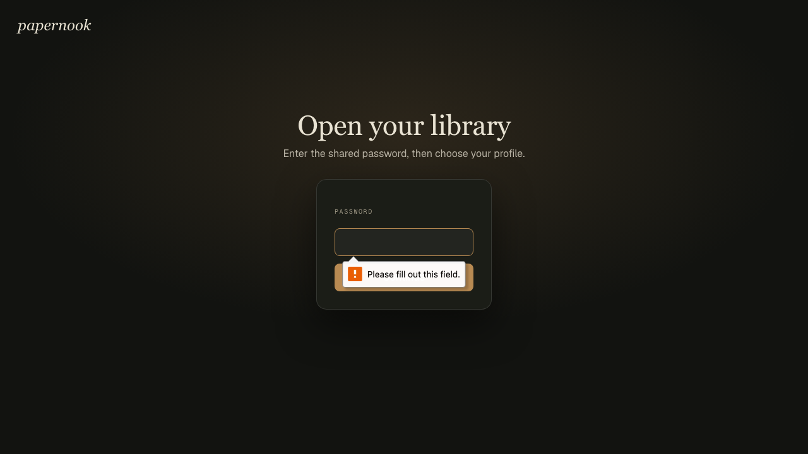
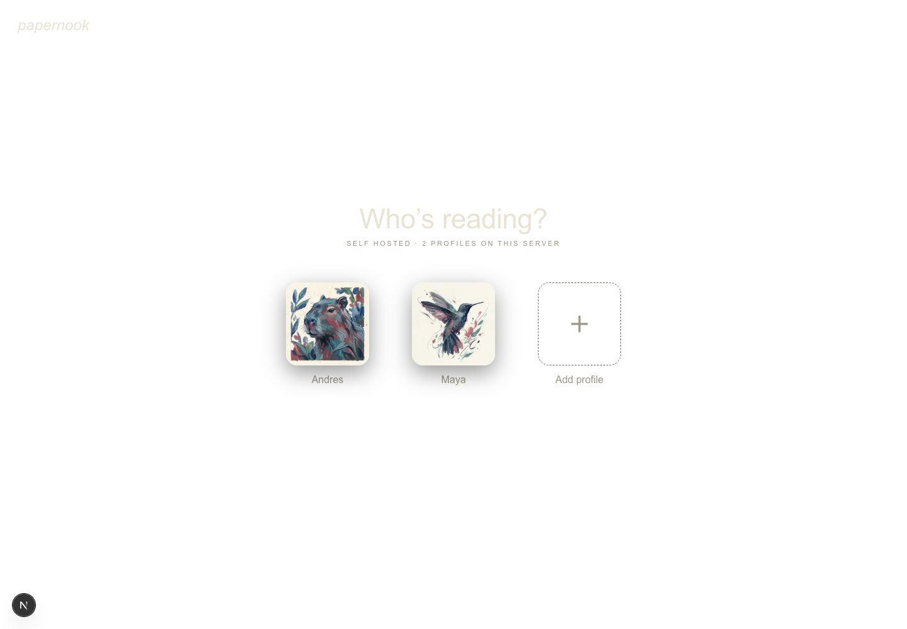
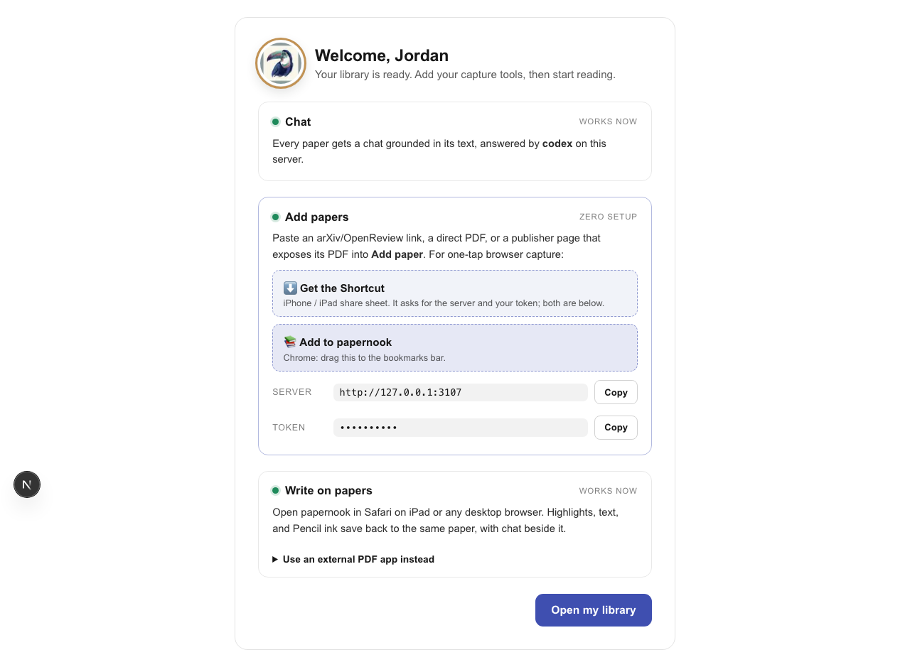
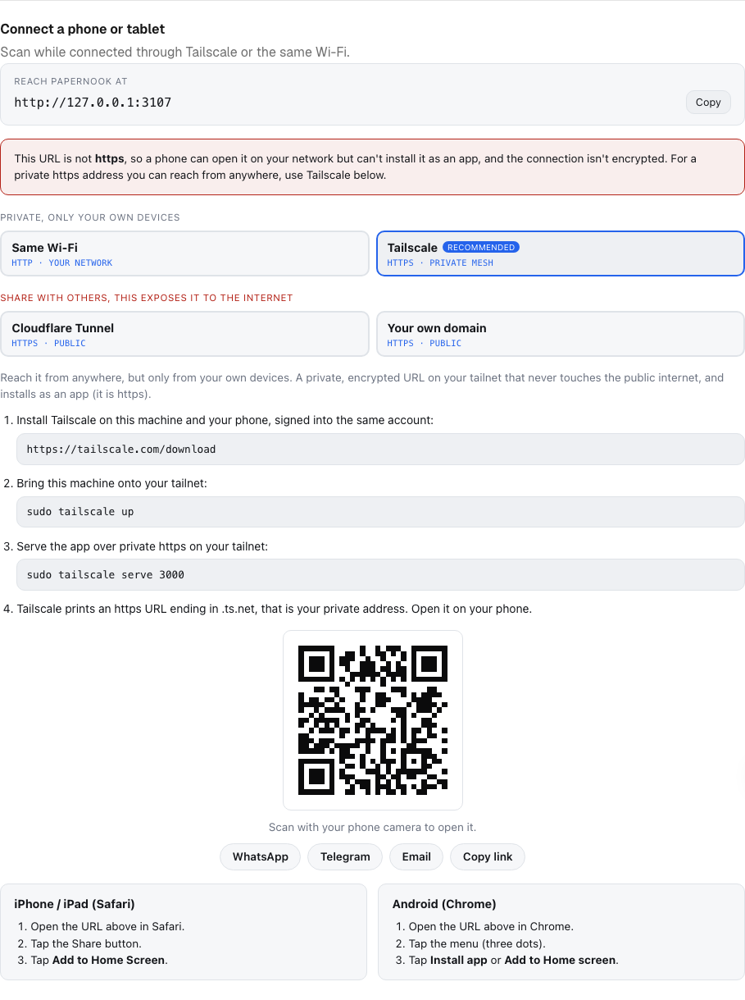
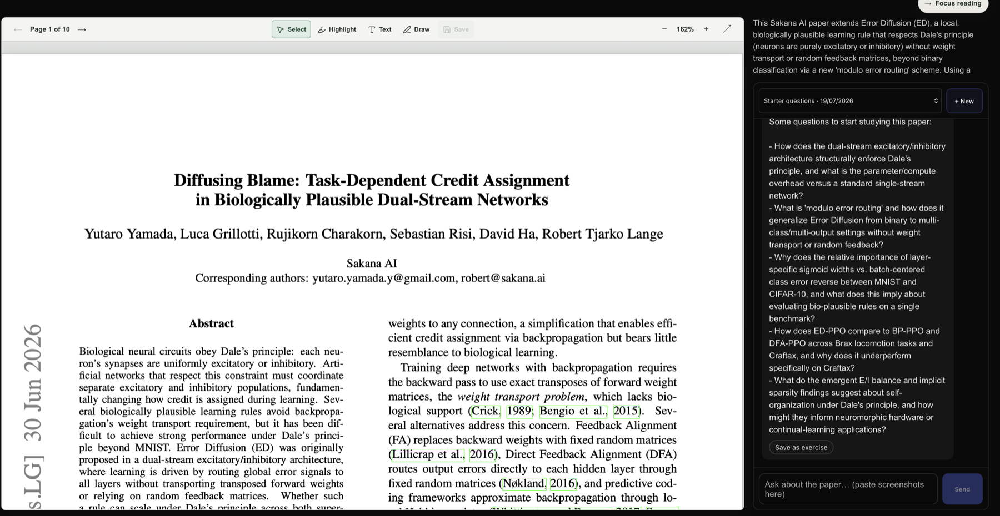
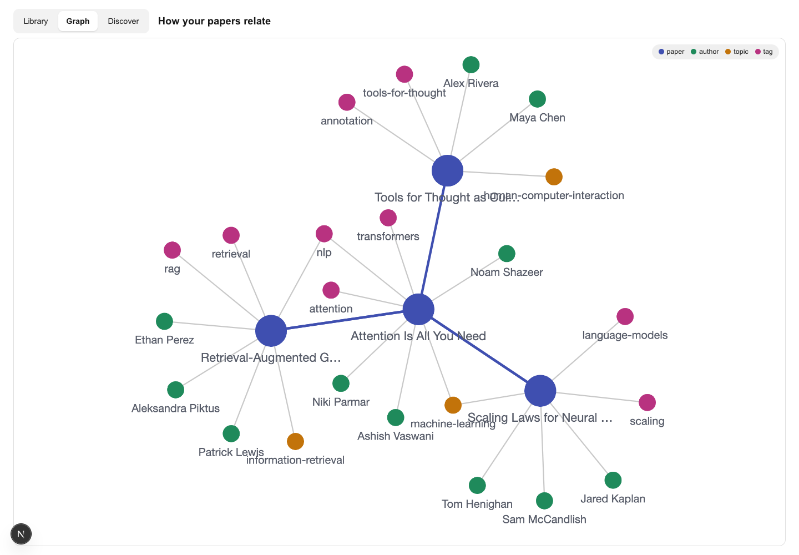
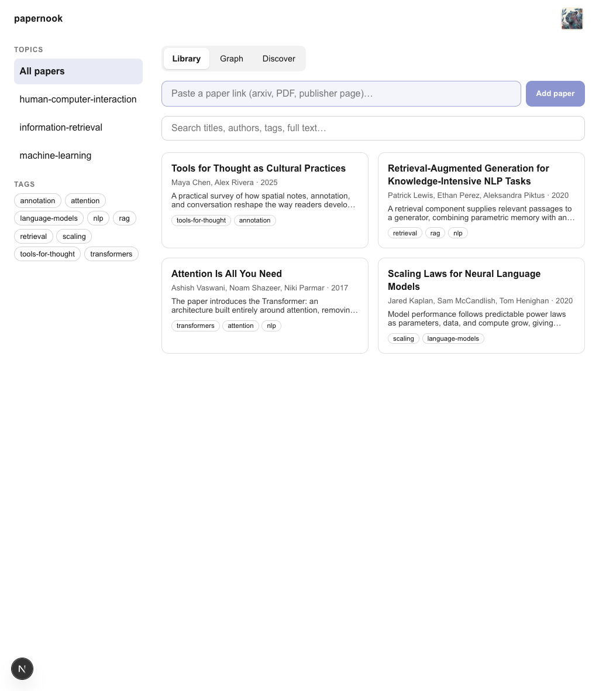
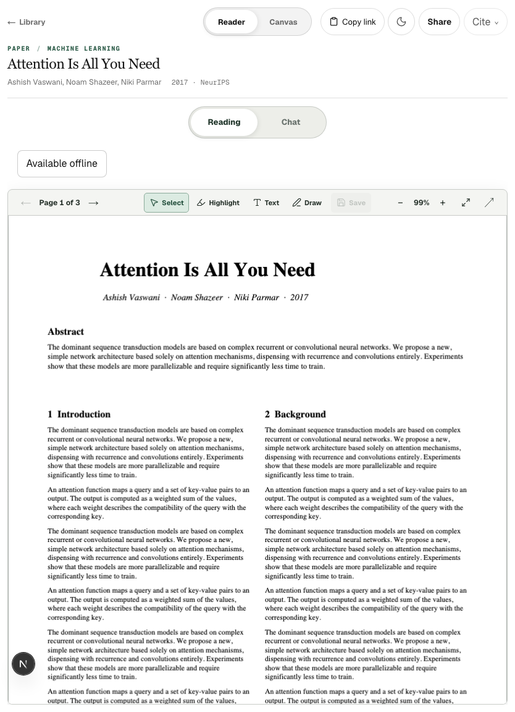

# Papernook documentation

Everything you need to go from an empty server to a shared, Pencil-ready paper
library.

> **New here?** Open Papernook, create the first profile, and follow the
> one-screen welcome flow. Then use the guide for the way you reach your
> server.

## Choose how you connect

| I have a custom domain                                                                                                  | I use Tailscale                                                                                                      |
| ----------------------------------------------------------------------------------------------------------------------- | -------------------------------------------------------------------------------------------------------------------- |
| Best when friends should open Papernook from any browser. HTTPS and an instance access password protect the public app. | Best when the library should stay off the public internet. Each device runs Tailscale before it can reach Papernook. |
| App: `https://papernook.example.com`                                                                                    | App: `https://papernook-server.<tailnet>.ts.net`                                                                     |
| WebDAV: `https://dav-papernook.example.com`                                                                             | WebDAV: `http://papernook-server:8080`                                                                               |
| [Set up a custom domain →](public-exposure.md)                                                                          | [Invite over Tailscale →](user-guide.md#option-b-tailscale)                                                          |

Papernook always requires one instance access password before showing the
profile picker. After passing the gate, a visitor may choose any profile.
Profiles organize chats, capture tokens, and Zotero connections by reader, but
they are not a security boundary. Anyone with the instance password can switch
profiles and read any profile's chats.



Tailscale Serve supplies the HTTPS address the app needs for secure sessions.
Authentication is identical for every hostname. Host headers cannot select a
passwordless route.

## Start here

1. **Open your library:** create or choose a profile.
2. **Add a paper:** paste a link into the library, install the
   [browser extension](../extension/README.md) for Safari or Chrome, or add
   the [iPhone/iPad Shortcut](shortcut.md).
3. **Write on the PDF:** open the paper in Papernook on desktop or iPad; see
   the [iPad guide](ipad-annotation.md).
4. **Bring in another reader:** follow the
   [domain or Tailscale invite flow](user-guide.md#invite-a-friend).

For backup, restore, upgrades, rollback, and deployment checks, see
[Operations](operations.md).


## What to expect

### One library, separate readers



Each person chooses a profile. Papers, folders, tags, annotations, and exercises
are shared. Chats, capture tokens, and Zotero connections remain per-profile
for organization, not access control.

### A setup screen that fills itself in



The welcome flow reads the server configuration and presents the exact links
and credentials that person needs. Secrets stay masked until copied.

### A direct handoff to another device



Open **Settings → Connect a device** from the address you want the new device
to use. The QR code preserves that domain, Tailscale hostname, or LAN address.

### The paper and its conversations together


Read and annotate the live PDF, resume prior chats, save exercises, or create a
view-only reading from one screen. **Focus reading** hides chat on desktop and
expands the PDF; the preference persists until **Show chat** is selected.




### Two more ways to see the library



**Graph** connects papers to their authors, topics, tags, and related
readings. **Discover** asks the configured AI what to read next, grounded in
what the library already holds; each suggestion carries a link that files
through the normal capture flow.

### Explicit, revocable sharing


A shared reading includes the current annotated PDF. Conversation snapshots
are opt-in; later private messages never appear in an existing link.

## On iPad

The library and paper workspace adapt to a tablet-sized screen:

| Library                                                                      | Paper and chat                                                                    |
| ---------------------------------------------------------------------------- | --------------------------------------------------------------------------------- |
|  |  |

Open the paper in Safari. Papernook detects Apple Pencil input, enables Draw,
autosaves annotations, and keeps Chat available in its own tablet tab. WebDAV
is optional compatibility for external PDF apps.

## Guides

| Goal                                                        | Guide                                            |
| ----------------------------------------------------------- | ------------------------------------------------ |
| Learn the everyday capture, reading, chat, and sharing flow | [User guide](user-guide.md)                      |
| Invite a friend through a domain or Tailscale               | [Invite a friend](user-guide.md#invite-a-friend) |
| Install or rebuild the iPhone/iPad Shortcut                 | [Add to papernook Shortcut](shortcut.md)         |
| Annotate the live PDF with Apple Pencil                     | [iPad annotation guide](ipad-annotation.md)      |
| Put the app behind a public HTTPS domain safely             | [Custom domain setup](public-exposure.md)        |
| Back up, restore, upgrade, or roll back the server          | [Operations](operations.md)                      |
| Understand the security model or report a vulnerability     | [Security policy](../SECURITY.md)                |

## Owner checklist

- Keep `data/` backed up. The filesystem, not SQLite, is the source of truth.
- For a subscription CLI, log in on the Docker host first. Papernook checks
  both installation and authentication before calling the provider ready.
  Docker gives a networkless sidecar read-only access to the selected CLI's
  credential directory; use **Reload CLI login** in Settings after login or
  logout. See `.env.example` for `CODEX_AUTH_DIR` and `CLAUDE_AUTH_DIR`.
  Configure both directories only when both local CLIs should be selectable.
- Use a long, unique `WEBDAV_PASS`.
- Set the required `PAPERNOOK_PASSWORD` for every installation. For a custom
  domain, also set `PAPERNOOK_WEBDAV_URL`, then keep
  the default loopback port bindings behind Caddy.
- Generate friend links from **Settings → Invite a friend** while visiting the
  URL the friend will use.
- Rotate a capture token in Settings if it appears anywhere it should not.
- Readers can erase their own per-profile data from Settings; admins can remove
  members completely. Shared confirmed papers remain with anonymized
  attribution.

## Screenshot contract

The images in this guide are browser snapshots of seeded, synthetic data—never
a real library. The Playwright journey verifies the access gate, profile
creation, local CLI detection, reading focus mode, sharing, graph, setup cards,
and tablet layouts.

```bash
npx playwright install chromium  # once per development machine
npm run test:e2e                 # compare the UI with committed screenshots
npm run screenshots              # intentionally regenerate docs/images
```

<p align="center"><a href="../README.md">← Project README</a></p>
