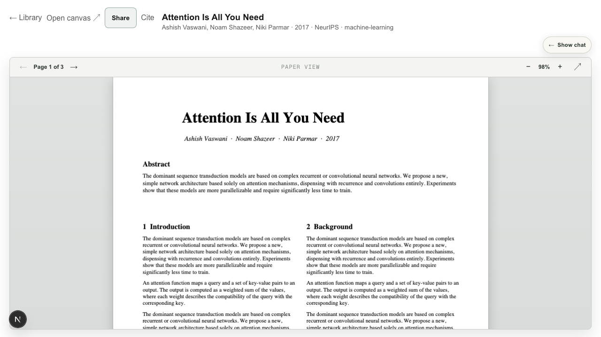
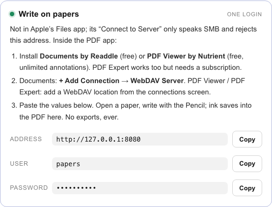

# Papernook documentation

Everything you need to go from an empty server to a shared, Pencil-ready paper
library.

> **New here?** Open Papernook, create the first profile, and follow the
> one-screen welcome flow. Then use the guide for the way you reach your
> server.

## Choose how you connect

| I have a custom domain                                                                                                  | I use Tailscale                                                                                                      |
| ----------------------------------------------------------------------------------------------------------------------- | -------------------------------------------------------------------------------------------------------------------- |
| Best when friends should open Papernook from any browser. HTTPS and an instance access password protect the public app. | Best when the library should stay off the public internet. Each device runs Tailscale before it can reach Papernook. |
| App: `https://papernook.example.com`                                                                                    | App: `https://papernook-server.<tailnet>.ts.net`                                                                     |
| WebDAV: `https://dav.papernook.example.com`                                                                             | WebDAV: `http://papernook-server:8080`                                                                               |
| [Harden a public domain →](public-exposure.md)                                                                          | [Invite over Tailscale →](user-guide.md#option-b-tailscale)                                                          |

On a public domain, the admin sets one instance password. A friend either
opens a seven-day signed invite or enters that shared password once before the
profile picker; they never create a profile password.


Tailscale Serve supplies the HTTPS address the app needs for secure sessions.
Using both routes is supported: `PAPERNOOK_PUBLIC_HOST` gives the custom domain
its password gate while the `.ts.net` address keeps the private household
flow. The [Tailscale invite guide](user-guide.md#option-b-tailscale) includes
the commands.

## Start here

1. **Open your library:** create or choose a profile.
2. **Add a paper:** paste a link into the library, install the
   [Safari/iOS Shortcut](shortcut.md), or use the Chrome bookmarklet from
   Settings.
3. **Write on the PDF:** connect an iPad PDF app using the
   [WebDAV walkthrough](ipad-annotation.md).
4. **Bring in another reader:** follow the
   [domain or Tailscale invite flow](user-guide.md#invite-a-friend).


## What to expect

### One library, separate readers


Each person chooses a profile. Papers, folders, tags, annotations, exercises,
and canvases are shared. Chats, capture tokens, and Zotero connections remain
per-profile.

### A setup screen that fills itself in


The welcome flow reads the server configuration and presents the exact links
and credentials that person needs. Secrets stay masked until copied.

### A direct handoff to another device


Open **Settings → Connect a device** from the address you want the new device
to use. The QR code preserves that domain, Tailscale hostname, or LAN address.

### The paper and its conversations together


Read the live PDF, resume prior chats, save exercises, open the canvas, or
create a view-only reading from one screen. **Focus reading** hides chat and
expands the PDF or canvas; the preference persists until **Show chat** is
selected.


### A spatial view of the library


The graph connects papers to their authors, topics, tags, and related readings.
The infinite canvas gives each individual paper a place for drawings, notes,
embeds, and selected-region explanations.



### Explicit, revocable sharing


A shared reading includes the current annotated PDF. Conversation snapshots
are opt-in; later private messages never appear in an existing link.

## On iPad

The library and paper workspace adapt to a tablet-sized screen:

| Library                                                                      | Paper and chat                                                                    |
| ---------------------------------------------------------------------------- | --------------------------------------------------------------------------------- |
|  |  |

For Pencil annotation, use a PDF app that writes standard annotations over
WebDAV. The welcome flow gives each reader the exact address and credentials.



## Guides

| Goal                                                                | Guide                                             |
| ------------------------------------------------------------------- | ------------------------------------------------- |
| Learn the everyday capture, reading, chat, canvas, and sharing flow | [User guide](user-guide.md)                       |
| Invite a friend through a domain or Tailscale                       | [Invite a friend](user-guide.md#invite-a-friend)  |
| Install or rebuild the Safari/iOS Shortcut                          | [Add to Papernook Shortcut](shortcut.md)          |
| Annotate the live PDF with Apple Pencil                             | [iPad annotation over WebDAV](ipad-annotation.md) |
| Put the app behind a public HTTPS domain safely                     | [Public exposure hardening](public-exposure.md)   |
| Understand the security model or report a vulnerability             | [Security policy](../SECURITY.md)                 |

## Owner checklist

- Keep `data/` backed up. The filesystem, not SQLite, is the source of truth.
- For a subscription CLI, log in on the Docker host first. Papernook checks
  both installation and authentication before calling the provider ready.
  Docker mounts only the selected provider's credential file; see
  `.env.example` for `CODEX_AUTH_FILE` and `CLAUDE_AUTH_FILE`.
- Use a long, unique `WEBDAV_PASS`.
- For a custom domain, set `PUBLIC_EXPOSURE`, `PAPERNOOK_PUBLIC_HOST`,
  `PAPERNOOK_PASSWORD`, `SESSION_SECRET`, and loopback port bindings before
  exposing the proxy.
- Generate friend links from **Settings → Invite a friend** while visiting the
  URL the friend will use.
- Rotate a capture token in Settings if it appears anywhere it should not.
- Readers can erase their own private data from Settings; admins can remove
  members completely. Shared confirmed papers remain with anonymized
  attribution.

## Screenshot contract

The images in this guide are browser snapshots of seeded, synthetic data—never
a private library. The Playwright journey verifies the public gate, profile
creation without a password, local CLI detection, reading focus mode, sharing,
graph, setup cards, and tablet layouts.

```bash
npx playwright install chromium  # once per development machine
npm run test:e2e                 # compare the UI with committed screenshots
npm run screenshots              # intentionally regenerate docs/images
```

<p align="center"><a href="../README.md">← Project README</a></p>
