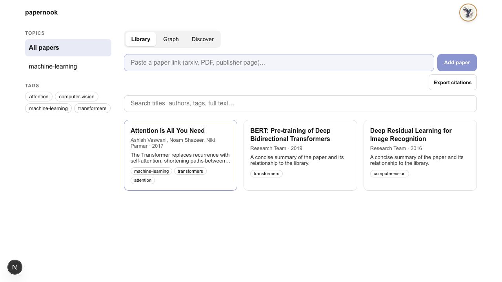
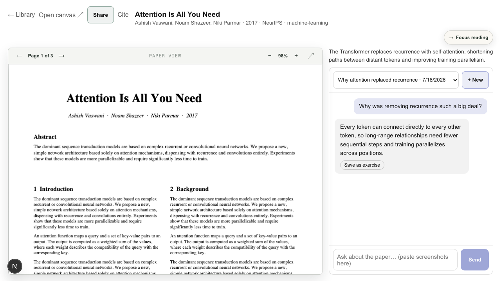
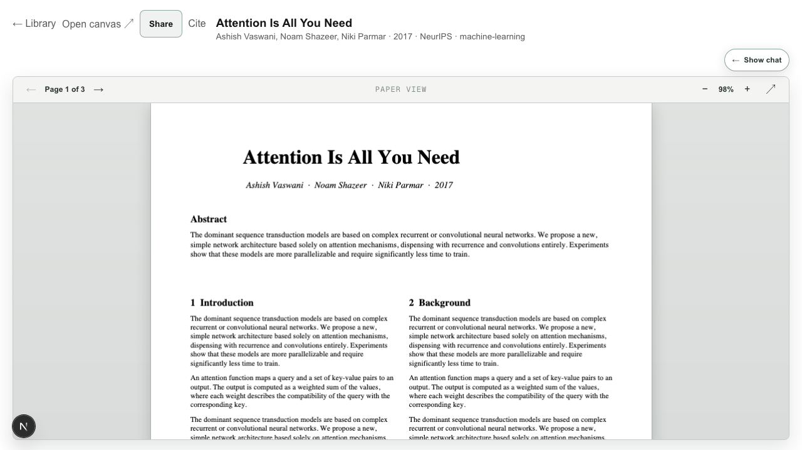
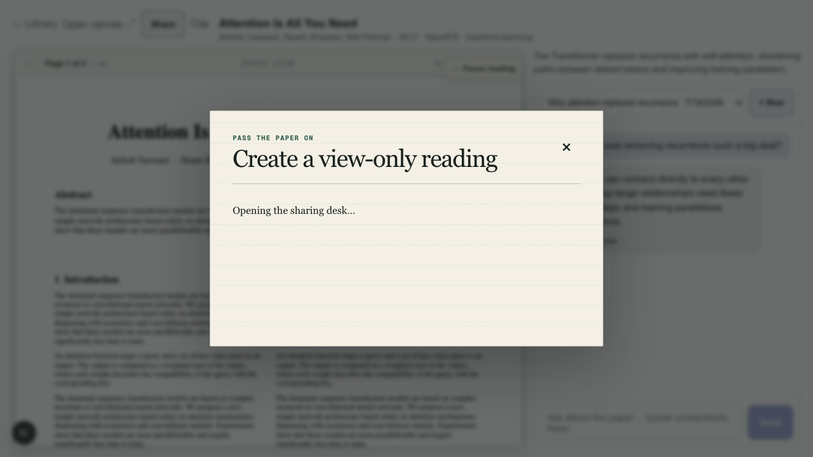
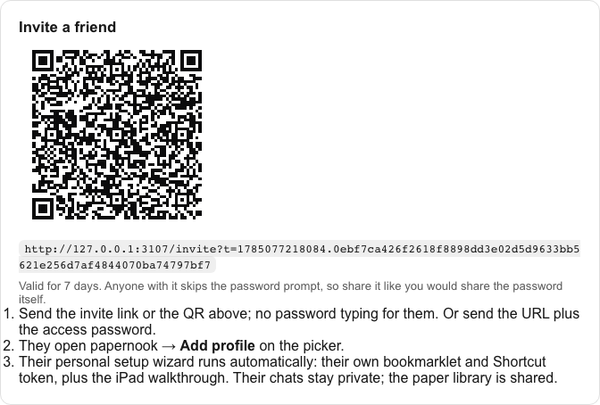

# User guide

[← Documentation home](README.md)

## Daily use

### Add a paper

- **From anywhere:** copy an arXiv/OpenReview URL, direct PDF URL, or publisher
  page that exposes a PDF link; paste it into **Add paper**, then select
  **Add paper**.
- **From Safari on iPhone, iPad, or Mac:** Share →
  **Add to Papernook**. Install it once from **Get the Shortcut**; see the
  [Shortcut guide](shortcut.md).
- **From Chrome on desktop:** select **📚 Add to Papernook** in the bookmarks
  bar. Drag it there once from Settings.

Papernook opens a confirmation page with the proposed topic, tags, summary,
related papers, and starter questions. Review it and select
**Accept into library**.



### Read, annotate, and ask

Open a library card to put the PDF and its chat side by side. Ask a starter
question, continue an earlier conversation, or paste a marked-up screenshot
and ask what it means.



Select **Focus reading** to hide the chat and give the PDF or canvas the full
workspace. Select **Show chat** to restore it. Papernook remembers that choice
between papers and when you switch between the reader and canvas.



To write with Apple Pencil, open the same PDF from Papernook's WebDAV
connection in Documents, PDF Viewer, PDF Expert, or another compatible PDF
app. Ink saves into the file on the server; there is no export step. Follow
the [iPad annotation guide](ipad-annotation.md).

### Explore and practice

- Select **Open canvas** to arrange pages on an infinite board, add notes,
  paste embeds, draw, and send a selection to chat.
- On an assistant answer, select **Save as exercise**. Papernook renders
  `<paper>.exercises.pdf` beside the paper over WebDAV.
- From the canvas toolbar, use **+ margin space** or **+ blank page** when a
  paper needs more writing room. Existing ink does not move.
- Open **Graph** to move through connections among papers, authors, topics,
  tags, and related readings.

### Share a reading

Select **Share** on a paper, then **Create link & copy**. The link is
view-only and revocable. The current annotated PDF is included; conversation
snapshots stay off unless you select them.



## Invite a friend

First choose the route that matches your server:

| Your setup                                             | Use this flow                            |
| ------------------------------------------------------ | ---------------------------------------- |
| Papernook opens at an HTTPS domain from any browser    | [Custom domain](#option-a-custom-domain) |
| Papernook is reachable only after connecting Tailscale | [Tailscale](#option-b-tailscale)         |

The result is the same in both cases:

- **Shared:** papers, folders, tags, annotations, exercises, and canvases.
- **Private to each profile:** chats, capture token, and Zotero connection.
- **One admin-owned public password:** friends never set a profile password.

### Option A: custom domain

Before inviting anyone, the owner should finish
[public exposure hardening](public-exposure.md), including
`PAPERNOOK_PASSWORD`.

1. Open Papernook through its public URL, such as
   `https://papernook.example.com`.
2. Go to **Settings → Invite a friend**.
3. Send the invite link or let your friend scan the QR code. Generate it from
   the public URL so the link contains the hostname they can reach.
4. Your friend opens the link, selects **Add profile**, chooses a name and
   animal, and follows the welcome screen.



The signed invite is valid for seven days and lets that browser reach the
profile picker without typing the shared access password. It does not create a
profile or grant admin rights. Rotating `SESSION_SECRET` invalidates unused
invite links.

**Alternative:** send the public URL and the shared access password. Your
friend enters it once, then follows **Add profile**.

> **Expected result:** the new profile opens its own welcome flow with a
> personal capture token and the server's WebDAV details. No existing chat is
> visible.

### Option B: Tailscale

Production sessions require HTTPS, so publish the app through Tailscale Serve
instead of sending raw port `3000`:

1. On the Papernook server, run:

   ```bash
   tailscale serve --bg 3000
   tailscale serve --bg --tcp=8080 tcp://127.0.0.1:8080
   tailscale serve status
   ```

   The status output gives the app an HTTPS `.ts.net` URL and keeps WebDAV on
   port `8080`.

2. In the [Tailscale Machines page](https://login.tailscale.com/admin/machines),
   open the Papernook server, select **Share**, and send the generated link or
   email invitation.
3. Your friend accepts it and installs Tailscale on each device that will use
   Papernook.
4. Send the HTTPS app address from `tailscale serve status`, such as
   `https://papernook-server.example-tailnet.ts.net`.
5. They open the address, select **Add profile**, choose a name and animal,
   and follow the welcome screen.
6. For iPad annotation, use
   `http://papernook-server.example-tailnet.ts.net:8080` as the WebDAV address
   and share the common `WEBDAV_USER` and `WEBDAV_PASS` securely.

If MagicDNS does not resolve a shared machine's short name, use its full
`<hostname>.<tailnet>.ts.net` name or Tailscale IP. If the person is already a
trusted member of your tailnet, skip the machine-sharing step and send the
address.

Machine sharing limits access to that machine. Inviting a user to the tailnet
can expose more devices and services unless your access controls restrict
them; see Tailscale's
[inviting-versus-sharing guide](https://tailscale.com/docs/reference/inviting-vs-sharing)
and [machine-sharing steps](https://tailscale.com/docs/features/sharing).

> **Using a domain and Tailscale together?** Set
> `PAPERNOOK_PUBLIC_HOST=papernook.example.com`. The public hostname gets the
> password gate; the Tailscale Serve hostname keeps the private profile-picker
> flow.

### If a friend cannot connect

1. Confirm they can open the app URL before setting up WebDAV.
2. For Tailscale, confirm the shared machine appears online in their Machines
   list and try its Tailscale IP.
3. For a domain, open a fresh invite from the public hostname; old links
   expire after seven days.
4. For Tailscale, run `tailscale serve status` and open the listed HTTPS URL.
   For a domain, confirm HTTPS reaches Caddy.
5. Test WebDAV separately with the URL for the same route and verify the
   `WEBDAV_USER` and `WEBDAV_PASS`.

View or rotate your personal capture token at any time in **Settings**.

## Delete a profile and its private data

Every reader can open **Settings → Delete my profile**, type their username,
and erase their own personal data. An admin can use **Settings → Members** to
remove another reader completely.

Deletion removes the profile, session access, capture token, Zotero
configuration and cursor, chats, pasted chat crops, unconfirmed captures,
owned share links, and stored login-rate state. Confirmed PDFs, annotations,
canvases, exercises, summaries, and metadata remain part of the shared
library; the deleted username is removed from their capture attribution. If
the admin deletes their own profile, the oldest remaining profile becomes the
admin.
